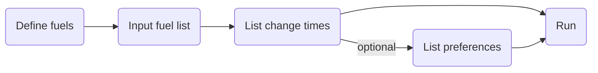

# Enrichment Versatile non-Equilibrium Reactor (EVER)
EVER is a modular Cyclus reactor archetype based on Cycamore's Reactor, except that it has the ability to update the recipe of fuel in a reactor over time. The archetype achieves this at multiple levels of fidelity:

## RecipeUpdate (Lowest Level Fidelity)
Using user defined recipes, use the EVER archetype as you would the Cycamore Reactor RecipeChange


You can consult the example in `/update/ever_update_test.xml`, or use the following special tags in your input file:

```
<recipe_update_times>
    <val>68</val> <val>268</val>
</recipe_update_times>
<recipe_update_commods>
    <val>fresh_otr</val> <val>fresh_uox</val>
</recipe_update_commods>
<recipe_update_in>
    <val>fresh_otr</val> <val>fresh_uox</val>
</recipe_update_in>
<recipe_update_out>
    <val>used_otr_u</val> <val>used_uox</val>
</recipe_update_out>
```

> [!Important]
> The only recipe that will be updated is the first one you put in <fuel_inrecipes>!

